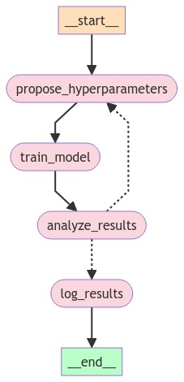

# Data Science Agent

Welcome to the Data Science Agent project! 

This repository is designed to explore automation of various data science tasks. 
Currently, its focused on the process of hyperparameter optimization using a Reasoning + Action (ReAct) LLM agent in the `agent_HPO_ReAct.ipynb` notebook, which is designed to iteratively improve machine learning model performance by optimizing hyperparameters.

This work is motivated by the papers in the `Reference` section of this README.


## Getting Started

To get started with this notebook, you'll need to set up your environment and install the necessary dependencies. Follow these steps:

1. **Clone the repository:**
   ```bash
   git clone https://github.com/your-username/data_science_agent.git
   cd data_science_agent
   ```

2. **Install dependencies using Poetry and activate the environment:**
   ```bash
   poetry install
   poetry shell
   ```

3. **Create a `.env` file:**
   Copy the `.env.example` file to `.env` and fill in the necessary environment variables.

4. **Install a new IPython kernel for Jupyter:**
    ```bash
    python -m ipykernel install --user --name ds-agent --display-name "ds-agent"
    ```
5. **Run the Jupyter Notebook:**
   Launch Jupyter Notebook and open `notebooks/agent_HPO_ReAct.ipynb` to start experimenting.


## Notebook `agent_HPO_ReAct.ipynb`


This notebook orchestrates the process of hyperparameter (HP) optimization using a ReAct LLM agent.

The example chosen in the notebook is optimizing Random Forest Classifier on Census Income Dataset.

Choice of LLM is `gpt-4o`

The overall idea is best described using the following diagram (foreshadowing of a future langgraph implementation)



Essentially, we give the LLM some tools, and basic information (in natural language) about the dataset, ML model, and which hyperparameters to tune.

Then it proposes and initial set of HPs, tests them, analyzes the results, uses its knowledge to improve the next set of proposed hyperparamaters and so on and so forth until it decides that the metric has plateaud.

Roughly speaking, its leveraging random search boosted by LLM's knowledge.


Please note that the main objective of this implementation is to explore the possibilities of a ReAct style agent in optimizing HPs quickly.

Because ideally we'd perform nested cross-validation for optimizing hyperparameters, and use Bayesian optimization methods to iteratively improve the search space. 
Both of those can be easily implemented in the current framework. 

In lieu of the current objective, however, we want to reduce computational overhead and get quick results, so the hyperparameters are tuned on training set, and metrics are evaluated on test set.
The chain of thought process for the agent and the experiment summary log examples can be found under `notebooks/logs`

## References
The notebook is motivated by the following papers:
1) Large Language Model Agent for Hyper-Parameter Optimization https://arxiv.org/pdf/2402.01881
2) AutoML-GPT: Automatic Machine Learning with GPT https://arxiv.org/pdf/2305.02499